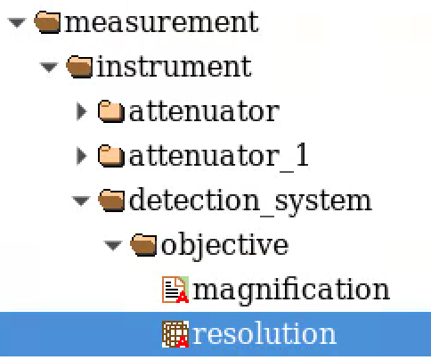
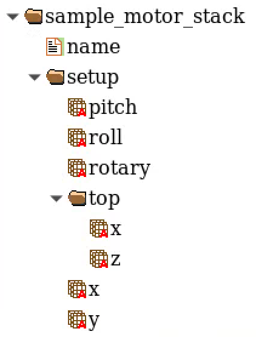
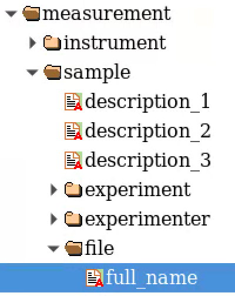

=====
Usage
=====
 
1. Verify the dataset is valid
==============================

Tile needs the following experiment meta data to automatically sort the mosaic tiles by location and set the initial overlapping conditions:

#. X-Y location of each tile in mm
#. the projection image pixel size in microns
#. the tile data set full file name

At the APS beamline `2 BM <https://docs2bm.readthedocs.io/en/latest/>`_, these meta data are automatically stored at data collection time in an hdf file compliant with `dxfile <https://dxfile.readthedocs.io/en/latest/index.html>`_ following this layout:

#. sample_x  (mm)         = '/measurement/instrument/sample_motor_stack/setup/x'
#. sample_y  (mm)         = '/measurement/instrument/sample_motor_stack/setup/y'
#. resolution (micron)    = '/measurement/instrument/detection_system/objective/resolution'
#. full_file_name         = '/measurement/sample/file/full_name'

If these parameters are stored somewhere else in your hdf file, you can set their locations at runtime using the 
--sample-x, --sample-y, --resolution --full-file-name options. 

#. --sample-x '/your_hdf_path/to_sample_x_in_mm'
#. --sample-y '/your_hdf_path/to_sample_y_in_mm'
#. --resolution '/your_hdf_path/to_image_resolution_in_micron'
#. --full-file-name '/your_hdf_path/to_the_full_file_name'

By default, these are set to:

#. --sample-x '/measurement/instrument/sample_motor_stack/setup/x'
#. --sample-y '/measurement/instrument/sample_motor_stack/setup/y'
#. --resolution '/measurement/instrument/detection_system/objective/resolution'
#. --full-file-name '/measurement/sample/file/full_name'

to meet the `dxfile <https://dxfile.readthedocs.io/en/latest/source/demo/doc.areadetector.html#xml>`_ definitions for 
beamlines `2 BM <https://docs2bm.readthedocs.io/en/latest/>`_ , `7 BM <https://docs7bm.readthedocs.io/en/latest/>`_ 
and `32 ID <https://docs32id.readthedocs.io/en/latest/>`_.

Once the above are confirmed, you can validate the mosaic data set with:
::

    (tomocupy) tomo@tomo4 $ tile show --folder-name /data/2021-12/Duchkov/mosaic/
    2022-02-16 11:33:38,485 - Started tile
    2022-02-16 11:33:38,485 - Saving log at /home/beams/TOMO/logs/tile_2022-02-16_11_33_38.log
    2022-02-16 11:33:38,485 - checking tile files ...
    2022-02-16 11:33:38,487 - Checking directory: /data/2021-12/Duchkov/mosaic for a tile scan
    2022-02-16 11:33:38,864 - tile file sorted
    2022-02-16 11:33:38,865 - x0y0: x = -0.000100; y = 28.000000, file name = /data/2021-12/Duchkov/mosaic/mosaic_2073.h5, original file name = /local/data/2021-12/Duchkov/mosaic_2073.h5
    2022-02-16 11:33:38,865 - x1y0: x = 0.849900; y = 28.000000, file name = /data/2021-12/Duchkov/mosaic/mosaic_2074.h5, original file name = /local/data/2021-12/Duchkov/mosaic_2074.h5
    2022-02-16 11:33:38,865 - x2y0: x = 1.699900; y = 28.000000, file name = /data/2021-12/Duchkov/mosaic/mosaic_2075.h5, original file name = /local/data/2021-12/Duchkov/mosaic_2075.h5
    2022-02-16 11:33:38,865 - x3y0: x = 2.549900; y = 28.000000, file name = /data/2021-12/Duchkov/mosaic/mosaic_2076.h5, original file name = /local/data/2021-12/Duchkov/mosaic_2076.h5
    2022-02-16 11:33:38,865 - x4y0: x = 3.399900; y = 28.000000, file name = /data/2021-12/Duchkov/mosaic/mosaic_2077.h5, original file name = /local/data/2021-12/Duchkov/mosaic_2077.h5
    2022-02-16 11:33:39,035 - image   size (x, y) in pixels: (2448, 2048)
    2022-02-16 11:33:39,035 - tile shift (x, y) in pixels: (2428, 0)
    2022-02-16 11:33:39,035 - tile overlap (x, y) in pixels: (20, 2048)
    2022-02-16 11:33:39,040 - tile file name grid:
                                                 y_0                                          y_1                                          y_2                                          y_3                                          y_4
    x_0  /data/2021-12/Duchkov/mosaic/mosaic_2073.h5  /data/2021-12/Duchkov/mosaic/mosaic_2074.h5  /data/2021-12/Duchkov/mosaic/mosaic_2075.h5  /data/2021-12/Duchkov/mosaic/mosaic_2076.h5  /data/2021-12/Duchkov/mosaic/mosaic_2077.h5

2. Quick panoramic inspection (optional)
=========================================

Before running the time-consuming center search, use **tile panoramic** to quickly verify the tile layout and get a visual impression of the nominal overlap quality. It reads a single projection (at the angle set by ``--nprojection``, default 0.5 = midpoint) from each tile, normalizes it, and saves a wide stitched image to ``tile/panoramic.tif``:

::

    (tomocupy) tomo@tomo4 $ tile panoramic --flat-linear True

Open the result in `Fiji ImageJ <https://imagej.net/software/fiji/>`_ to confirm:

- All tiles are present and in the correct order.
- The nominal overlap looks approximately correct (the seam regions may not be perfect yet — that is fine and expected).
- The sample fills the expected field of view.

Once you have determined the correct shifts (after running **tile shift**), you can regenerate the panoramic with the corrected positions:

::

    (tomocupy) tomo@tomo4 $ tile panoramic --flat-linear True --x-shifts "[0, 5430, 5419]"

3. Find rotation center
=======================

**tile center** finds the rotation axis location of the stitched dataset. It stitches all horizontal tiles in the **top row** (y0) of the tile grid using the nominal overlap distance stored in the hdf file, then reconstructs a stack of trial slices over a search range around the specified rotation axis. The vertical sinogram row used is controlled by ``--nsino`` (default 0.5 = vertical center of the detector; adjustable from 0 top to 1 bottom). With ``--binning N``, ``2**N`` consecutive sinogram rows are averaged. The reconstruction is performed with the engine specified by ``--recon-engine`` (tomocupy or tomopy).

.. warning::

   The default value of ``--reverse-grid`` (True) assumes that moving the sample stage in the positive X direction moves the sample to the **left** in the image (as seen by the detector). This is the case at 2-BM after the detector upgrade. If you are using an older setup where positive X moves the sample to the **right**, pass ``--reverse-grid False`` explicitly.

   The default value of ``--file-type`` is ``double_fov``, which is the standard mode at 2-BM. Pass ``--file-type standard`` for single field-of-view datasets.

Use ``--flat-linear True`` when flat fields were collected at the beginning and end of the scan (e.g. 20+20): the first and second halves are averaged separately and linearly interpolated across all projection angles for more accurate normalization.

.. note::

   At this stage only the **center of the reconstructed image** is reliable. The outer regions (left and right "donuts") may look blurry because the nominal tile overlap from the hdf file is only approximate. Ignore the outer regions and focus on the center when selecting the rotation axis.

The recommended workflow is **two passes**: a coarse search to locate the approximate center, followed by a fine search to pin it down to sub-pixel accuracy.

**Pass 1 — coarse search** (wide step, large range):

::

    (tomocupy) tomo@tomo4 ~/conda/tile-decarlof $ tile center --recon-engine tomocupy --rotation-axis 400 --file-type double_fov --binning 2 --nsino-per-chunk 2 --flat-linear True
    2026-03-24 15:18:38,306 - Started tile
    2026-03-24 15:18:38,306 - Saving log at /home/beams/TOMO/logs/tile_2026-03-24_15_18_38.log
    2026-03-24 15:18:38,306 - Run find rotation axis location
    ...
    2026-03-24 15:18:41,679 - image   size (x, y) in pixels: (6464, 4852)
    2026-03-24 15:18:41,679 - stitch shift (x, y) in pixels: (5416, 4561)
    2026-03-24 15:18:41,679 - tile overlap (x, y) in pixels: (1048, 291)
    2026-03-24 15:18:48,953 - Created a temporary hdf file: /gdata/dm/2BM/2026-03/2026-03-Nikitin-0/data/tile/tmp.h5
    2026-03-24 15:18:48,954 - tomocupy recon --file-type double_fov --binning 2 --reconstruction-type try --file-name /gdata/dm/2BM/2026-03/2026-03-Nikitin-0/data/tile/tmp.h5             --center-search-width 10.0 --rotation-axis-auto manual --rotation-axis 400.0             --center-search-step 0.5 --end-column -1 --nsino-per-chunk 2 --flat-linear True
    2026-03-24 15:19:55,427 - Processing slice 0
    queue size 000 |  |████████████████████████████████████████| 100.0%
    2026-03-24 15:20:00,821 - Reconstruction time 1.2e+01s
    2026-03-24 15:20:05,333 - Please open the stack of images from /gdata/dm/2BM/2026-03/2026-03-Nikitin-0/data/tile_rec/try_center/tmp/recon* and select the rotation center

Use `Fiji ImageJ <https://imagej.net/software/fiji/>`_  to load the reconstructed slice stack with File/Import/Image Sequence:

.. image:: img/tile_center_00.png
   :width: 720px
   :alt: project

Zoom into the center region of the image and move the slider:

.. image:: img/tile_center_01.png
   :width: 720px
   :alt: project

until the center of the image is sharp and free of artifacts:

.. image:: img/tile_center_02.png
   :width: 720px
   :alt: project

Note the rotation axis value shown in the top-left corner of the best image (656 in this example). Then re-run with a finer step centered on that value.

**Pass 2 — fine search** (small step, narrow range):

::

    (tomocupy) tomo@tomo4 ~/conda/tile-decarlof $ tile center --recon-engine tomocupy --rotation-axis 656 --file-type double_fov --binning 2 --nsino-per-chunk 2 --flat-linear True --center-search-width 10 --center-search-step 1
    2026-03-24 16:42:14,152 - Started tile
    2026-03-24 16:42:14,152 - Saving log at /home/beams/TOMO/logs/tile_2026-03-24_16_42_14.log
    2026-03-24 16:42:14,152 - Run find rotation axis location
    ...
    2026-03-24 16:42:17,524 - image   size (x, y) in pixels: (6464, 4852)
    2026-03-24 16:42:17,525 - stitch shift (x, y) in pixels: (5416, 4561)
    2026-03-24 16:42:17,525 - tile overlap (x, y) in pixels: (1048, 291)
    2026-03-24 16:42:25,225 - Created a temporary hdf file: /gdata/dm/2BM/2026-03/2026-03-Nikitin-0/data/tile/tmp.h5
    2026-03-24 16:42:25,226 - tomocupy recon --file-type double_fov --binning 2 --reconstruction-type try --file-name /gdata/dm/2BM/2026-03/2026-03-Nikitin-0/data/tile/tmp.h5             --center-search-width 10.0 --rotation-axis-auto manual --rotation-axis 656.0             --center-search-step 1.0 --end-column -1 --nsino-per-chunk 2 --flat-linear True
    2026-03-24 16:43:31,516 - Processing slice 0
    queue size 000 |  |████████████████████████████████████████| 100.0%
    2026-03-24 16:43:36,281 - Reconstruction time 1.1e+01s
    2026-03-24 16:43:40,757 - Please open the stack of images from /gdata/dm/2BM/2026-03/2026-03-Nikitin-0/data/tile_rec/try_center/tmp/recon* and select the rotation center

Inspect the stack again and record the final rotation axis (650 in this example). Store this for the next step.

4. Tile Shift
=============

**tile center** used the nominal tile overlap distance stored in the hdf file. In this step, **tile shift** fine-tunes each tile's horizontal position. It operates on the **top row (y0)** of the tile grid, using the same sinogram row as ``tile center`` (controlled by ``--nsino``).

For each tile boundary (there are N-1 boundaries for N horizontal tiles), the tool reconstructs a stack of slices by sliding the overlap of the adjacent tile by ``--shift-search-width`` pixels in steps of ``--shift-search-step`` pixels on either side of the nominal position. The total number of shifts tried per boundary is ``2 * shift_search_width / shift_search_step`` (default: 40 shifts per boundary with ``--shift-search-width 20 --shift-search-step 1``).

A progress bar is displayed during processing and, when complete, a color-coded index map is printed:

- **green** indices correspond to negative offsets (tiles closer together than nominal)
- **red** index corresponds to 0 px offset (perfect motor motion = nominal overlap)
- **yellow** indices correspond to positive offsets (tiles farther apart than nominal)

The user is then prompted to enter the index of the best-looking frame from the reconstructed stack (or stitched projections), repeating for each tile boundary. The prompt shows the **nominal index** (the one corresponding to 0 px correction), which is the correct answer if motor positioning was perfect.

::

    (tomocupy) tomo@tomo4 ~/conda/tile-decarlof $ tile shift --flat-linear True --rotation-axis 650
    2026-03-25 15:29:12,127 - Started tile
    2026-03-25 15:29:12,128 - Saving log at /home/beams/TOMO/logs/tile_2026-03-25_15_29_12.log
    2026-03-25 15:29:12,128 - Run manual shift
    2026-03-25 15:29:12,128 - checking tile files ...
    2026-03-25 15:29:12,128 - Checking directory: /gdata/dm/2BM/2026-03/2026-03-Nikitin-0/data for a tile scan
    2026-03-25 15:29:14,421 - tile file sorted
    2026-03-25 15:29:14,422 - x0y0: x = 0.900000; y = -3.000000, file name = .../coffe_beam_mosaic_001.h5
    2026-03-25 15:29:14,422 - x1y0: x = 2.800000; y = -3.000000, file name = .../coffe_beam_mosaic_002.h5
    2026-03-25 15:29:14,422 - x2y0: x = 4.700000; y = -3.000000, file name = .../coffe_beam_mosaic_003.h5
    ...
    2026-03-25 15:29:15,577 - image   size (x, y) in pixels: (6464, 4852)
    2026-03-25 15:29:15,577 - stitch shift (x, y) in pixels: (5416, 4561)
    2026-03-25 15:29:15,577 - tile overlap (x, y) in pixels: (1048, 291)
    Please enter rotation center (656.2): 650
    2026-03-25 15:29:16,100 - Processing tile boundary 1 of 2
      [████████████████████████████████████████] 80/80 (+39 px)
    Index-to-pixel-offset map for tile 1: 0=-40px, 1=-39px, ... 40=+0px, ... 79=+39px
    2026-03-25 15:47:00,123 - Please open the stack of images from reconstructions .../tile_rec/tmp_rec/recon* or stitched projections .../tile_rec/tmp_proj/p*, and select the file id to shift tile 1
    Please enter id for tile 1 shift [nominal: 40] corresponding to 0 pixel shift from the nominal overlap of 1048 px stored in the raw data files:

Use `Fiji ImageJ <https://imagej.net/software/fiji/>`_  to load the reconstructed slice or projection stack with File/Import/Image Sequence:

.. image:: img/tile_shift_00.png
   :width: 720px
   :alt: project

Zoom into the region of the image separating the two tiles and move the slider:

.. image:: img/tile_shift_01.png
   :width: 720px
   :alt: project

until the boundary region between the two tiles is sharp and free of artifacts:

.. image:: img/tile_shift_02.png
   :width: 720px
   :alt: project

The file name in Fiji's title bar (e.g. ``recon_00054.tif``) tells you the index to enter. In the example above that is index 54, which maps to +14 px from the index-to-pixel-offset map — meaning the stage was 14 pixels (≈ 9 µm at 0.65 µm/px resolution) further apart than the motor position stored in the hdf file.

Pressing **Enter** without typing anything accepts the nominal index (0 px correction).

::

    Please enter id for tile 1 shift [nominal: 40] ...: 54
    2026-03-25 15:47:02,348 - Selected offset for tile 1: +14 px from nominal (index 54)
    2026-03-25 15:47:02,349 - Current shifts: [   0 5430 5416]

**tile shift** will now repeat the same process, keeping all previously fixed tiles fixed and sliding the next tile boundary only.

::

    2026-03-25 15:47:02,350 - Processing tile boundary 2 of 2
      [████████████████████████████████████████] 80/80 (+39 px)
    Index-to-pixel-offset map for tile 2: 0=-40px, 1=-39px, ... 40=+0px, ... 79=+39px
    2026-03-25 16:02:14,511 - Please open the stack of images from reconstructions .../tile_rec/tmp_rec/recon* ...
    Please enter id for tile 2 shift [nominal: 40] corresponding to 0 pixel shift from the nominal overlap of 1048 px stored in the raw data files: 43
    2026-03-25 16:02:20,812 - Selected offset for tile 2: +3 px from nominal (index 43)
    2026-03-25 16:02:20,813 - Current shifts: [   0 5430 5419]
    2026-03-25 16:02:20,814 - Center 650
    2026-03-25 16:02:20,815 - Relative shifts [0, 5430, 5419]

5. Tile Stitch
==============

At the end of **tile shift** step, we obtain the final shift list (e.g. ``[0, 5430, 5419]``) that we can use for the final tile stitching. **tile stitch** will generate a single hdf file merging all mosaic tiles with the correct overlap.

::

    (tomocupy) tomo@tomo4 $ tile stitch --folder-name /data/2021-12/Duchkov/mosaic --nproj-per-chunk 128 --x-shifts "[0, 2450, 2450, 2452, 2454]" 
    2022-02-16 18:30:06,770 - Started tile
    2022-02-16 18:30:06,770 - Saving log at /home/beams/TOMO/logs/tile_2022-02-16_18_30_06.log
    2022-02-16 18:30:06,770 - Run stitching
    2022-02-16 18:30:06,770 - checking tile files ...
    2022-02-16 18:30:06,770 - Checking directory: /data/2021-12/Duchkov/mosaic for a tile scan
    2022-02-16 18:30:07,146 - tile file sorted
    2022-02-16 18:30:07,146 - x0y0: x = -0.000100; y = 28.000000, file name = /data/2021-12/Duchkov/mosaic/mosaic_2073.h5, original file name = /local/data/2021-12/Duchkov/mosaic_2073.h5
    2022-02-16 18:30:07,146 - x1y0: x = 0.849900; y = 28.000000, file name = /data/2021-12/Duchkov/mosaic/mosaic_2074.h5, original file name = /local/data/2021-12/Duchkov/mosaic_2074.h5
    2022-02-16 18:30:07,146 - x2y0: x = 1.699900; y = 28.000000, file name = /data/2021-12/Duchkov/mosaic/mosaic_2075.h5, original file name = /local/data/2021-12/Duchkov/mosaic_2075.h5
    2022-02-16 18:30:07,146 - x3y0: x = 2.549900; y = 28.000000, file name = /data/2021-12/Duchkov/mosaic/mosaic_2076.h5, original file name = /local/data/2021-12/Duchkov/mosaic_2076.h5
    2022-02-16 18:30:07,146 - x4y0: x = 3.399900; y = 28.000000, file name = /data/2021-12/Duchkov/mosaic/mosaic_2077.h5, original file name = /local/data/2021-12/Duchkov/mosaic_2077.h5
    2022-02-16 18:30:07,321 - Relative shifts [   0 2450 2450 2452 2454]
    2022-02-16 18:30:07,323 - Stitching projections 0 - 128
    2022-02-16 18:30:20,461 - Stitching projections 128 - 256
    2022-02-16 18:30:32,099 - Stitching projections 256 - 384
    2022-02-16 18:30:50,475 - Stitching projections 384 - 512
    2022-02-16 18:31:12,040 - Stitching projections 512 - 640
    2022-02-16 18:31:30,324 - Stitching projections 640 - 768
    2022-02-16 18:31:49,881 - Stitching projections 768 - 896
    2022-02-16 18:32:08,534 - Stitching projections 896 - 1024
    2022-02-16 18:32:26,784 - Stitching projections 1024 - 1152
    2022-02-16 18:32:47,320 - Stitching projections 1152 - 1280
    2022-02-16 18:33:04,260 - Stitching projections 1280 - 1408
    2022-02-16 18:33:23,326 - Stitching projections 1408 - 1536
    2022-02-16 18:33:41,526 - Stitching projections 1536 - 1664
    2022-02-16 18:34:00,341 - Stitching projections 1664 - 1792
    2022-02-16 18:34:18,362 - Stitching projections 1792 - 1920
    2022-02-16 18:34:37,191 - Stitching projections 1920 - 2048
    2022-02-16 18:34:55,829 - Stitching projections 2048 - 2176
    2022-02-16 18:35:15,554 - Stitching projections 2176 - 2304
    2022-02-16 18:35:33,733 - Stitching projections 2304 - 2432
    2022-02-16 18:35:58,429 - Stitching projections 2432 - 2560
    2022-02-16 18:36:16,669 - Stitching projections 2560 - 2688
    2022-02-16 18:36:37,403 - Stitching projections 2688 - 2816
    2022-02-16 18:37:01,131 - Stitching projections 2816 - 2944
    2022-02-16 18:37:21,374 - Stitching projections 2944 - 3072
    2022-02-16 18:37:40,137 - Stitching projections 3072 - 3200
    2022-02-16 18:37:55,265 - Stitching projections 3200 - 3328
    2022-02-16 18:38:13,574 - Stitching projections 3328 - 3456
    2022-02-16 18:38:35,979 - Stitching projections 3456 - 3584
    2022-02-16 18:38:57,068 - Stitching projections 3584 - 3712
    2022-02-16 18:39:16,547 - Stitching projections 3712 - 3840
    2022-02-16 18:39:40,333 - Stitching projections 3840 - 3968
    2022-02-16 18:40:01,126 - Stitching projections 3968 - 4096
    2022-02-16 18:40:23,886 - Stitching projections 4096 - 4224
    2022-02-16 18:40:44,862 - Stitching projections 4224 - 4352
    2022-02-16 18:41:08,228 - Stitching projections 4352 - 4480
    2022-02-16 18:41:30,260 - Stitching projections 4480 - 4608
    2022-02-16 18:41:52,968 - Stitching projections 4608 - 4736
    2022-02-16 18:42:14,439 - Stitching projections 4736 - 4864
    2022-02-16 18:42:36,661 - Stitching projections 4864 - 4992
    2022-02-16 18:42:58,154 - Stitching projections 4992 - 5120
    2022-02-16 18:43:21,760 - Stitching projections 5120 - 5248
    2022-02-16 18:43:43,310 - Stitching projections 5248 - 5376
    2022-02-16 18:44:04,637 - Stitching projections 5376 - 5504
    2022-02-16 18:44:22,942 - Stitching projections 5504 - 5632
    2022-02-16 18:44:45,562 - Stitching projections 5632 - 5760
    2022-02-16 18:45:03,388 - Stitching projections 5760 - 5888
    2022-02-16 18:45:23,980 - Stitching projections 5888 - 6000
    2022-02-16 18:55:02,606 - Output file /data/2021-12/Duchkov/mosaic/tile/tile.h5
    2022-02-16 19:03:41,109 - Reconstruct /data/2021-12/Duchkov/mosaic/tile/tile.h5 with tomocupy:
    2022-02-16 19:03:41,110 - tomocupy recon --file-name /data/2021-12/Duchkov/mosaic/tile/tile.h5 --rotation-axis 1246 --reconstruction-type full --file-type double_fov --remove-stripe-method fw --binning 0 --nsino-per-chunk 8 --rotation-axis-auto manual
    2022-02-16 19:03:41,110 - Reconstruct /data/2021-12/Duchkov/mosaic/tile/tile.h5 with tomopy:
    2022-02-16 19:03:41,110 - tomopy recon --file-name /data/2021-12/Duchkov/mosaic/tile/tile.h5 --rotation-axis 1246 --reconstruction-type full --file-type double_fov --remove-stripe-method fw --binning 0 --nsino-per-chunk 8 --rotation-axis-auto manual

6. Tile reconstruction
======================

Once the stitching is completed the tomographic reconstruction can be done with `tomocupy <https://tomocupy.readthedocs.io/en/latest/>`_ or `tomopy <https://tomopy.readthedocs.io/en/latest/>`_/`tomopycli <https://tomopycli.readthedocs.io/en/latest/>`_:

with **tomocupy**
::
 
    (tomocupy) tomo@tomo4 $ tomocupy recon --file-name /data/2021-12/Duchkov/mosaic/tile/tile.h5 --rotation-axis 1246 --reconstruction-type full --file-type double_fov --remove-stripe-method fw --binning 0 --nsino-per-chunk 8 --rotation-axis-auto manual

with **tomopy**
::
 
    (tomocupy) tomo@tomo4 $ tomopy recon --file-name /data/2021-12/Duchkov/mosaic/tile/tile.h5 --rotation-axis 1246 --reconstruction-type full --file-type double_fov --remove-stripe-method fw --binning 0 --nsino-per-chunk 8 --rotation-axis-auto manual

For more options:
::

    (tomocupy) tomo@tomo4 $ tile -h
    (tomocupy) tomo@tomo4 $ tile stitch -h
    (tomocupy) tomo@tomo4 $ tile shift -h

Quick Start Guide
=================

This section summarizes the full mosaic reconstruction workflow in plain language for new users.

**What you have:** a set of hdf5 files, each containing a tomographic scan of one tile of the sample. The tiles overlap slightly and together cover a field of view larger than a single scan.

**What you want:** a single reconstructed 3D volume of the full sample.

The process has six steps (step 2 is optional):

----

Step 1 — Verify the dataset (``tile show``)
--------------------------------------------

**What it does:**

Reads the hdf metadata from all tile files, sorts them by motor position, and prints the tile grid layout, image size, and nominal overlap. Use this to confirm all tiles are present and correctly ordered before doing anything else.

::

    (tomocupy) tomo@tomo4 $ tile show --folder-name /path/to/data

----

Step 2 — Quick panoramic inspection (optional, ``tile panoramic``)
------------------------------------------------------------------

**What it does:**

Reads a single projection from each tile, normalizes it, and saves a wide stitched image to ``tile/panoramic.tif`` using the nominal overlap from the hdf file (or ``--x-shifts`` if provided). Open the result in Fiji to visually confirm the tile layout and get a sense of the overlap quality before running the longer center search.

::

    (tomocupy) tomo@tomo4 $ tile panoramic --flat-linear True

----

Step 3 — Find the rotation center (``tile center``)
----------------------------------------------------

**What it does:**

Takes all horizontal tiles from the top row of the mosaic, stitches them side by side using the nominal overlap stored in the hdf file, and reconstructs a stack of trial images — each one using a slightly different rotation axis position. You inspect the stack and pick the sharpest image.

.. note::

   Only the **center of the reconstructed image** is reliable at this stage. The outer regions (left and right "donuts") may look blurry because the nominal tile overlap from the hdf file is only approximate. Ignore the outer regions for now and focus on the center.

**How to run (two passes recommended):**

*Pass 1 — coarse:* start with a large search range to find the approximate center::

    (tomocupy) tomo@tomo4 $ tile center --recon-engine tomocupy --file-type double_fov \
        --binning 2 --nsino-per-chunk 2 --flat-linear True \
        --rotation-axis 400 --center-search-width 100 --center-search-step 5

Open the output stack in Fiji (File → Import → Image Sequence), zoom into the **center of the image**, and move the slider until the center region is sharp. Note the rotation axis value shown in the top-left corner of the best image (e.g. 656).

*Pass 2 — fine:* narrow the search around the value you found::

    (tomocupy) tomo@tomo4 $ tile center --recon-engine tomocupy --file-type double_fov \
        --binning 2 --nsino-per-chunk 2 --flat-linear True \
        --rotation-axis 656 --center-search-width 5 --center-search-step 0.1

Repeat the Fiji inspection and record the final value (e.g. **656.2**). This is your rotation center.

----

Step 4 — Fine-tune the tile overlap positions (``tile shift``)
---------------------------------------------------------------

**What it does:**

The nominal overlap from the hdf file is only approximate (limited by stage positioning accuracy, typically a few micrometers). This step fine-tunes the horizontal position of each tile relative to its neighbor so that the full stitched image — including the outer "donut" regions — is sharp.

It works tile by tile, left to right. For each tile boundary it tries sliding the adjacent tile by ±20 pixels (adjustable) from the nominal position and reconstructs a stack for you to inspect. You pick the frame where the **boundary region between the two tiles** looks sharpest and seamless.

**How to run:**

::

    (tomocupy) tomo@tomo4 $ tile shift --flat-linear True --rotation-axis 656.2

When prompted, confirm or update the rotation center. For each tile boundary the tool:

1. Runs the reconstruction for all candidate shifts (progress bar displayed).
2. Prints a color-coded index map: **green** = negative offset, **red** = nominal (0 px), **yellow** = positive offset.
3. Asks you to enter an index.

Then:

1. Open the reconstruction stack ``tile_rec/tmp_rec/recon*`` **or** the projection stack ``tile_rec/tmp_proj/p*`` in Fiji.
2. Zoom into the **overlap region between the two tiles** (not the center of the image).
3. Move the slider until the boundary is sharp and artifact-free.
4. Read the index from the file name shown by Fiji (e.g. ``recon_00054.tif`` → index 54) and enter it at the prompt.

.. note::

   The prompt shows ``[nominal: 40]`` (or whichever index corresponds to 0 px offset). Pressing **Enter** without typing accepts the nominal, which is correct when stage positioning is perfect. A selection of 54 where nominal is 40 means the stage was +14 px (≈ 9 µm at 0.65 µm/px) farther apart than the hdf file recorded.

Repeat for each tile boundary. At the end the tool prints the final shift array, e.g.::

    Current shifts: [0, 5430, 5419]

Save this for the next step.

----

Step 5 — Stitch all tiles into a single file (``tile stitch``)
---------------------------------------------------------------

**What it does:**

Uses the corrected overlap positions from Step 2 to merge all mosaic tiles (all rows, all projections) into a single hdf5 file ready for reconstruction.

**How to run:**

::

    (tomocupy) tomo@tomo4 $ tile stitch --x-shifts "[0, 5418, 5420]" --nproj-per-chunk 128

The output file is written to ``tile/tile.h5`` inside your data folder.

----

Step 6 — Reconstruct (``tomocupy`` or ``tomopy``)
--------------------------------------------------

**What it does:**

Runs the full tomographic reconstruction on the stitched file.

**How to run:**

::

    (tomocupy) tomo@tomo4 $ tomocupy recon --file-name /path/to/tile/tile.h5 \
        --rotation-axis 656.2 --reconstruction-type full \
        --file-type double_fov --flat-linear True \
        --remove-stripe-method fw --binning 0 \
        --nsino-per-chunk 4 --rotation-axis-auto manual
